# MIV Platform - Complete Rebuild Plan

<div align="center">


**Complete platform rebuild to compete with industry leaders**

</div>

---

## 🎯 Executive Summary

This document outlines a complete rebuild of the MIV Platform to meet and exceed industry standards, competing directly with market leaders like Affinity, DealCloud, Workiva, and Watershed. The rebuild will transform MIV from a basic venture management tool into a world-class, enterprise-grade platform for impact investing.

### 🏆 Target Market Position
- **Primary**: Leading venture pipeline management platform for impact investors
- **Secondary**: Comprehensive ESG/impact measurement platform
- **Tertiary**: Advanced relationship intelligence for development finance

---

## 📊 Market Analysis & Competitive Positioning

### 🏆 Market Leaders Analysis

| Platform | Strengths | Weaknesses | MIV Opportunity |
|----------|-----------|------------|-----------------|
| **Affinity** | Relationship intelligence, automation | Limited impact/ESG, no program ops | Unified platform with GEDSI focus |
| **DealCloud** | Enterprise features, configurability | Complex setup, expensive | Simplified enterprise experience |
| **Workiva** | Compliance, audit trails | Financial focus, expensive | Impact-focused compliance |
| **Watershed** | Carbon accounting, data connectors | Limited scope, no venture focus | Comprehensive impact platform |
| **Vera Solutions** | Impact measurement, Salesforce native | Salesforce dependency | Platform agnostic with better UX |

### 🎯 MIV Competitive Advantages

1. **Unified Platform**: CRM + Program Ops + Impact Measurement
2. **GEDSI-Native**: Built-in gender, disability, social inclusion tracking
3. **AI-First**: Advanced AI capabilities across all workflows
4. **Emerging Markets Focus**: Designed for developing economies
5. **Standards Compliance**: Native IRIS+, 2X, B Lab, ISSB support

---

## 🏗️ New Architecture Design

### 🏢 Enterprise Microservices Architecture

```mermaid
graph TB
    subgraph "Frontend Layer"
        A[Next.js 15 + React 19] --> B[TypeScript + Tailwind]
        B --> C[Radix UI + Shadcn/ui]
        C --> D[Real-time Updates]
    end
    
    subgraph "API Gateway Layer"
        E[Kong API Gateway] --> F[Rate Limiting]
        E --> G[Authentication]
        E --> H[Request Routing]
    end
    
    subgraph "Core Services"
        I[Venture Service] --> J[Venture Management]
        K[Relationship Service] --> L[Network Intelligence]
        M[Impact Service] --> N[GEDSI + IRIS+]
        O[Capital Service] --> P[Investment Pipeline]
        Q[Document Service] --> R[AI Document Analysis]
        S[Analytics Service] --> T[Real-time Analytics]
    end
    
    subgraph "AI/ML Layer"
        U[AI Gateway] --> V[OpenAI GPT-4]
        U --> W[Anthropic Claude]
        U --> X[Google AI Gemini]
        U --> Y[Custom ML Models]
    end
    
    subgraph "Data Layer"
        Z[PostgreSQL Primary] --> AA[Read Replicas]
        BB[Redis Cache] --> CC[Session Management]
        DD[Elasticsearch] --> EE[Search & Analytics]
        FF[Vector Database] --> GG[AI Embeddings]
    end
    
    subgraph "Infrastructure"
        HH[Kubernetes] --> II[Auto-scaling]
        JJ[AWS/GCP] --> KK[Multi-region]
        LL[Monitoring] --> MM[Observability]
    end
    
    A --> E
    E --> I
    E --> K
    E --> M
    E --> O
    E --> Q
    E --> S
    I --> U
    K --> U
    M --> U
    O --> U
    Q --> U
    S --> U
    I --> Z
    K --> Z
    M --> Z
    O --> Z
    Q --> Z
    S --> Z
    Z --> BB
    Z --> DD
    Z --> FF
    I --> HH
    K --> HH
    M --> HH
    O --> HH
    Q --> HH
    S --> HH
```



### 🔧 Technology Stack Overhaul

#### **Frontend Stack**
```typescript
// Modern React with Advanced Features
- Next.js 15 (App Router + Server Components)
- React 19 (Concurrent Features + Suspense)
- TypeScript 5.0 (Strict mode)
- Tailwind CSS 4.0 (Utility-first)
- Radix UI + Shadcn/ui (Accessible components)
- TanStack Query (Server state management)
- Zustand (Client state management)
- React Hook Form + Zod (Form validation)
- Recharts (Data visualization)
- Framer Motion (Animations)
- React Virtual (Performance optimization)
```

#### **Backend Stack**
```typescript
// Microservices with Modern Patterns
- Node.js 20 (Latest LTS)
- TypeScript 5.0 (Strict mode)
- Fastify (High-performance API framework)
- Prisma 5 (Type-safe ORM)
- PostgreSQL 15 (Primary database)
- Redis 7 (Caching & sessions)
- Elasticsearch 8 (Search & analytics)
- Weaviate (Vector database)
- Apache Kafka (Event streaming)
- RabbitMQ (Message queuing)
```

#### **AI/ML Stack**
```python
# Advanced AI Capabilities
- OpenAI GPT-4 (Text processing)
- Anthropic Claude (Reasoning)
- Google AI Gemini (Multi-modal)
- LangChain (AI orchestration)
- ChromaDB (Vector storage)
- Hugging Face (Custom models)
- TensorFlow/PyTorch (ML models)
- Ray (Distributed computing)
```

#### **Infrastructure Stack**
```yaml
# Enterprise Infrastructure
- Kubernetes (Container orchestration)
- Docker (Containerization)
- AWS/GCP (Cloud platform)
- Terraform (Infrastructure as code)
- ArgoCD (GitOps deployment)
- Prometheus + Grafana (Monitoring)
- ELK Stack (Logging)
- Jaeger (Distributed tracing)
- Istio (Service mesh)
```

---

## 🗄️ Database Architecture Redesign

### 📊 New Database Schema

```sql
-- Multi-tenant architecture with schema isolation
CREATE SCHEMA tenant_001;
CREATE SCHEMA tenant_002;

-- Core entities with advanced relationships
CREATE TABLE ventures (
    id UUID PRIMARY KEY DEFAULT gen_random_uuid(),
    tenant_id VARCHAR(50) NOT NULL,
    name VARCHAR(255) NOT NULL,
    description TEXT,
    sector VARCHAR(100),
    stage VARCHAR(50),
    status VARCHAR(50),
    founded_date DATE,
    team_size INTEGER,
    funding_raised DECIMAL(15,2),
    gedsi_score DECIMAL(5,2),
    impact_score DECIMAL(5,2),
    created_at TIMESTAMP DEFAULT NOW(),
    updated_at TIMESTAMP DEFAULT NOW(),
    
    -- Full-text search
    search_vector tsvector GENERATED ALWAYS AS (
        setweight(to_tsvector('english', name), 'A') ||
        setweight(to_tsvector('english', description), 'B') ||
        setweight(to_tsvector('english', sector), 'C')
    ) STORED
);

-- GEDSI metrics with disaggregation
CREATE TABLE gedsi_metrics (
    id UUID PRIMARY KEY DEFAULT gen_random_uuid(),
    venture_id UUID REFERENCES ventures(id),
    metric_code VARCHAR(20) NOT NULL, -- IRIS+ codes
    metric_name VARCHAR(255) NOT NULL,
    category VARCHAR(100),
    target_value DECIMAL(15,2),
    current_value DECIMAL(15,2),
    unit VARCHAR(50),
    disaggregation JSONB, -- Gender, age, location breakdown
    verification_status VARCHAR(50),
    verified_at TIMESTAMP,
    verified_by UUID,
    created_at TIMESTAMP DEFAULT NOW(),
    updated_at TIMESTAMP DEFAULT NOW()
);

-- Relationship intelligence
CREATE TABLE relationships (
    id UUID PRIMARY KEY DEFAULT gen_random_uuid(),
    venture_id UUID REFERENCES ventures(id),
    contact_id UUID REFERENCES contacts(id),
    relationship_type VARCHAR(50),
    strength_score DECIMAL(3,2), -- 0-1 scale
    last_interaction TIMESTAMP,
    interaction_count INTEGER DEFAULT 0,
    warm_intro_path JSONB, -- Path to warm introduction
    created_at TIMESTAMP DEFAULT NOW(),
    updated_at TIMESTAMP DEFAULT NOW()
);

-- AI analysis results
CREATE TABLE ai_analysis (
    id UUID PRIMARY KEY DEFAULT gen_random_uuid(),
    venture_id UUID REFERENCES ventures(id),
    analysis_type VARCHAR(50), -- readiness, risk, impact
    model_version VARCHAR(50),
    confidence_score DECIMAL(3,2),
    results JSONB,
    recommendations JSONB,
    created_at TIMESTAMP DEFAULT NOW()
);

-- Document management with AI
CREATE TABLE documents (
    id UUID PRIMARY KEY DEFAULT gen_random_uuid(),
    venture_id UUID REFERENCES ventures(id),
    name VARCHAR(255) NOT NULL,
    type VARCHAR(50),
    file_size BIGINT,
    mime_type VARCHAR(100),
    storage_path VARCHAR(500),
    ai_analysis JSONB, -- AI extraction results
    metadata JSONB,
    created_at TIMESTAMP DEFAULT NOW(),
    updated_at TIMESTAMP DEFAULT NOW()
);

-- Capital pipeline
CREATE TABLE capital_activities (
    id UUID PRIMARY KEY DEFAULT gen_random_uuid(),
    venture_id UUID REFERENCES ventures(id),
    activity_type VARCHAR(50),
    amount DECIMAL(15,2),
    currency VARCHAR(3) DEFAULT 'USD',
    stage VARCHAR(50),
    status VARCHAR(50),
    investor_name VARCHAR(255),
    terms JSONB,
    timeline JSONB,
    created_at TIMESTAMP DEFAULT NOW(),
    updated_at TIMESTAMP DEFAULT NOW()
);

-- Audit trail
CREATE TABLE audit_logs (
    id UUID PRIMARY KEY DEFAULT gen_random_uuid(),
    tenant_id VARCHAR(50) NOT NULL,
    user_id UUID,
    action VARCHAR(100),
    resource_type VARCHAR(50),
    resource_id UUID,
    old_values JSONB,
    new_values JSONB,
    ip_address INET,
    user_agent TEXT,
    created_at TIMESTAMP DEFAULT NOW()
);

-- Indexes for performance
CREATE INDEX idx_ventures_tenant ON ventures(tenant_id);
CREATE INDEX idx_ventures_stage ON ventures(stage);
CREATE INDEX idx_ventures_gedsi_score ON ventures(gedsi_score);
CREATE INDEX idx_ventures_search ON ventures USING GIN(search_vector);
CREATE INDEX idx_gedsi_metrics_venture ON gedsi_metrics(venture_id);
CREATE INDEX idx_relationships_venture ON relationships(venture_id);
CREATE INDEX idx_audit_logs_tenant ON audit_logs(tenant_id);
CREATE INDEX idx_audit_logs_created ON audit_logs(created_at);
```

---

## 🎨 UI/UX Redesign

### 🏠 Modern Dashboard Design

```typescript
// New Dashboard Layout
interface DashboardLayout {
  // Header with global search and notifications
  header: {
    logo: string;
    globalSearch: SearchComponent;
    notifications: NotificationCenter;
    userMenu: UserProfileMenu;
  };
  
  // Sidebar with intelligent navigation
  sidebar: {
    navigation: NavigationMenu;
    recentItems: RecentItemsList;
    quickActions: QuickActionButtons;
  };
  
  // Main content area with widgets
  mainContent: {
    overview: OverviewWidgets;
    analytics: AnalyticsDashboard;
    pipeline: PipelineView;
    insights: AIInsightsPanel;
  };
  
  // Right panel for context
  rightPanel: {
    ventureDetails: VentureDetailPanel;
    activityFeed: ActivityFeed;
    recommendations: AIRecommendations;
  };
}

// Component Examples
const OverviewWidgets = () => (
  <div className="grid grid-cols-1 md:grid-cols-2 lg:grid-cols-4 gap-6">
    <MetricCard
      title="Total Ventures"
      value={ventureCount}
      trend={+12}
      icon={<BuildingIcon />}
    />
    <MetricCard
      title="GEDSI Score"
      value={averageGedsiScore}
      trend={+5.2}
      icon={<UsersIcon />}
    />
    <MetricCard
      title="Capital Raised"
      value={formatCurrency(totalCapital)}
      trend={+23.4}
      icon={<DollarSignIcon />}
    />
    <MetricCard
      title="Pipeline Velocity"
      value={pipelineVelocity}
      trend={-2.1}
      icon={<TrendingUpIcon />}
    />
  </div>
);
```

### 🎯 Advanced Features

#### **Intelligent Search**
```typescript
// Global search with AI-powered suggestions
const GlobalSearch = () => {
  const [query, setQuery] = useState('');
  const [results, setResults] = useState<SearchResult[]>([]);
  
  const searchVentures = async (q: string) => {
    const response = await fetch(`/api/search?q=${encodeURIComponent(q)}`);
    const data = await response.json();
    return data.results;
  };
  
  return (
    <div className="relative">
      <SearchInput
        value={query}
        onChange={setQuery}
        placeholder="Search ventures, contacts, documents..."
        onSearch={searchVentures}
      />
      <SearchResults results={results} />
    </div>
  );
};
```

#### **Real-time Collaboration**
```typescript
// Real-time collaboration features
const CollaborationFeatures = () => {
  const [activeUsers, setActiveUsers] = useState<User[]>([]);
  const [comments, setComments] = useState<Comment[]>([]);
  
  useEffect(() => {
    // WebSocket connection for real-time updates
    const ws = new WebSocket(process.env.NEXT_PUBLIC_WS_URL!);
    ws.onmessage = (event) => {
      const data = JSON.parse(event.data);
      if (data.type === 'USER_ACTIVITY') {
        setActiveUsers(data.users);
      }
    };
  }, []);
  
  return (
    <div className="flex space-x-4">
      <ActiveUsersList users={activeUsers} />
      <CommentsPanel comments={comments} />
      <CollaborationTools />
    </div>
  );
};
```

---

## 🤖 AI Integration Redesign

### 🧠 Advanced AI Capabilities

#### **AI Service Architecture**
```typescript
// AI Service Layer
interface AIService {
  // Document Analysis
  analyzeDocument(file: File): Promise<DocumentAnalysis>;
  extractMetrics(document: File): Promise<ExtractedMetrics>;
  generateSummary(text: string): Promise<string>;
  
  // Venture Analysis
  assessReadiness(venture: Venture): Promise<ReadinessAssessment>;
  predictSuccess(venture: Venture): Promise<SuccessPrediction>;
  identifyRisks(venture: Venture): Promise<RiskAssessment>;
  
  // Relationship Intelligence
  findWarmIntros(venture: Venture): Promise<WarmIntroPath[]>;
  suggestConnections(venture: Venture): Promise<ConnectionSuggestion[]>;
  scoreRelationships(relationships: Relationship[]): Promise<RelationshipScore[]>;
  
  // Impact Assessment
  calculateImpact(venture: Venture): Promise<ImpactCalculation>;
  suggestMetrics(venture: Venture): Promise<MetricSuggestion[]>;
  validateCompliance(venture: Venture): Promise<ComplianceValidation>;
}

// Implementation
class AIServiceImpl implements AIService {
  private openai: OpenAI;
  private anthropic: Anthropic;
  private vectorDB: VectorDatabase;
  
  async analyzeDocument(file: File): Promise<DocumentAnalysis> {
    const text = await this.extractText(file);
    const embedding = await this.generateEmbedding(text);
    
    const analysis = await this.openai.chat.completions.create({
      model: 'gpt-4',
      messages: [
        {
          role: 'system',
          content: 'Analyze this venture document and extract key information.'
        },
        {
          role: 'user',
          content: text
        }
      ]
    });
    
    return {
      summary: analysis.choices[0].message.content,
      keyMetrics: await this.extractMetrics(text),
      risks: await this.identifyRisks(text),
      recommendations: await this.generateRecommendations(text)
    };
  }
}
```

#### **AI-Powered Workflows**
```typescript
// AI Workflow Automation
class AIWorkflowEngine {
  async processVentureIntake(venture: Venture): Promise<WorkflowResult> {
    // 1. Document Analysis
    const documentAnalysis = await this.aiService.analyzeDocument(venture.documents);
    
    // 2. Venture Assessment
    const assessment = await this.aiService.assessReadiness(venture);
    
    // 3. GEDSI Analysis
    const gedsiAnalysis = await this.aiService.calculateImpact(venture);
    
    // 4. Relationship Mapping
    const relationships = await this.aiService.findWarmIntros(venture);
    
    // 5. Generate Recommendations
    const recommendations = await this.aiService.generateRecommendations(venture);
    
    return {
      documentAnalysis,
      assessment,
      gedsiAnalysis,
      relationships,
      recommendations
    };
  }
}
```

---

## 🔧 API Redesign

### 🚀 Modern API Architecture

#### **RESTful API with GraphQL Gateway**
```typescript
// API Gateway Configuration
const apiGateway = {
  // REST API endpoints
  rest: {
    ventures: {
      GET: '/api/v1/ventures',
      POST: '/api/v1/ventures',
      PUT: '/api/v1/ventures/:id',
      DELETE: '/api/v1/ventures/:id'
    },
    gedsi: {
      GET: '/api/v1/gedsi/metrics',
      POST: '/api/v1/gedsi/metrics',
      PUT: '/api/v1/gedsi/metrics/:id'
    },
    capital: {
      GET: '/api/v1/capital/activities',
      POST: '/api/v1/capital/activities'
    },
    ai: {
      POST: '/api/v1/ai/analyze',
      POST: '/api/v1/ai/assess',
      POST: '/api/v1/ai/recommend'
    }
  },
  
  // GraphQL schema
  graphql: `
    type Venture {
      id: ID!
      name: String!
      description: String
      stage: VentureStage!
      gedsiMetrics: [GEDSIMetric!]!
      capitalActivities: [CapitalActivity!]!
      documents: [Document!]!
      relationships: [Relationship!]!
      aiAnalysis: AIAnalysis
    }
    
    type Query {
      ventures(filters: VentureFilters): VentureConnection!
      venture(id: ID!): Venture
      gedsiDashboard: GEDSIDashboard
      capitalDashboard: CapitalDashboard
    }
    
    type Mutation {
      createVenture(input: CreateVentureInput!): Venture!
      updateVenture(id: ID!, input: UpdateVentureInput!): Venture!
      analyzeVenture(id: ID!): AIAnalysis!
    }
  `
};
```

#### **Real-time API with WebSockets**
```typescript
// WebSocket API for real-time features
class WebSocketAPI {
  private wss: WebSocketServer;
  
  constructor() {
    this.wss = new WebSocketServer({ port: 8080 });
    this.setupEventHandlers();
  }
  
  private setupEventHandlers() {
    this.wss.on('connection', (ws, req) => {
      // Authenticate connection
      const token = this.extractToken(req);
      const user = this.authenticateUser(token);
      
      // Subscribe to user's data
      ws.on('message', (message) => {
        const data = JSON.parse(message.toString());
        this.handleMessage(ws, data, user);
      });
    });
  }
  
  private handleMessage(ws: WebSocket, data: any, user: User) {
    switch (data.type) {
      case 'SUBSCRIBE_VENTURE':
        this.subscribeToVenture(ws, data.ventureId, user);
        break;
      case 'SUBSCRIBE_DASHBOARD':
        this.subscribeToDashboard(ws, user);
        break;
      case 'SEND_MESSAGE':
        this.broadcastMessage(data.ventureId, data.message, user);
        break;
    }
  }
}
```

---

## 🔒 Security & Compliance Redesign

### 🛡️ Enterprise Security Architecture

#### **Multi-Layer Security**
```typescript
// Security Configuration
const securityConfig = {
  // Network Security
  network: {
    waf: 'AWS WAF',
    ddosProtection: 'Cloudflare',
    vpc: {
      publicSubnets: ['10.0.1.0/24', '10.0.2.0/24'],
      privateSubnets: ['10.0.3.0/24', '10.0.4.0/24'],
      databaseSubnets: ['10.0.5.0/24', '10.0.6.0/24']
    }
  },
  
  // Application Security
  application: {
    authentication: {
      provider: 'Auth0',
      mfa: true,
      sessionTimeout: 3600,
      jwtSecret: process.env.JWT_SECRET
    },
    authorization: {
      rbac: true,
      abac: true,
      fieldLevelSecurity: true
    },
    inputValidation: {
      sanitization: true,
      rateLimiting: true,
      sqlInjectionProtection: true
    }
  },
  
  // Data Security
  data: {
    encryption: {
      atRest: 'AES-256',
      inTransit: 'TLS 1.3',
      keyManagement: 'AWS KMS'
    },
    privacy: {
      piiMasking: true,
      dataResidency: 'EU',
      gdprCompliance: true
    },
    audit: {
      logging: true,
      retention: '7 years',
      monitoring: true
    }
  }
};
```

#### **Compliance Features**
```typescript
// Compliance Management
class ComplianceManager {
  async validateGDPRCompliance(userId: string): Promise<ComplianceReport> {
    const userData = await this.getUserData(userId);
    const dataProcessing = await this.getDataProcessing(userId);
    
    return {
      dataMinimization: this.checkDataMinimization(userData),
      consentManagement: this.checkConsent(userId),
      rightToDeletion: this.checkDeletionCapability(userId),
      dataPortability: this.checkPortability(userId),
      auditTrail: await this.generateAuditTrail(userId)
    };
  }
  
  async generateSOC2Report(): Promise<SOC2Report> {
    return {
      securityControls: await this.auditSecurityControls(),
      availabilityControls: await this.auditAvailabilityControls(),
      processingIntegrity: await this.auditProcessingIntegrity(),
      confidentiality: await this.auditConfidentiality(),
      privacy: await this.auditPrivacy()
    };
  }
}
```

---

## 📊 Analytics & Reporting Redesign

### 📈 Advanced Analytics Platform

#### **Real-time Analytics Engine**
```typescript
// Analytics Service
class AnalyticsService {
  async generateDashboardMetrics(tenantId: string): Promise<DashboardMetrics> {
    const [
      ventureMetrics,
      gedsiMetrics,
      capitalMetrics,
      performanceMetrics
    ] = await Promise.all([
      this.getVentureMetrics(tenantId),
      this.getGEDSIMetrics(tenantId),
      this.getCapitalMetrics(tenantId),
      this.getPerformanceMetrics(tenantId)
    ]);
    
    return {
      ventures: ventureMetrics,
      gedsi: gedsiMetrics,
      capital: capitalMetrics,
      performance: performanceMetrics,
      generatedAt: new Date()
    };
  }
  
  async generateImpactReport(ventureId: string): Promise<ImpactReport> {
    const venture = await this.getVenture(ventureId);
    const metrics = await this.getGEDSIMetrics(ventureId);
    const analysis = await this.aiService.calculateImpact(venture);
    
    return {
      venture: venture,
      metrics: metrics,
      analysis: analysis,
      recommendations: await this.generateRecommendations(venture),
      compliance: await this.checkCompliance(venture),
      generatedAt: new Date()
    };
  }
}
```

#### **Predictive Analytics**
```typescript
// Predictive Analytics
class PredictiveAnalytics {
  async predictVentureSuccess(venture: Venture): Promise<SuccessPrediction> {
    const features = await this.extractFeatures(venture);
    const model = await this.loadModel('venture_success');
    
    const prediction = await model.predict(features);
    
    return {
      successProbability: prediction.probability,
      confidence: prediction.confidence,
      factors: prediction.factors,
      recommendations: await this.generateRecommendations(prediction)
    };
  }
  
  async forecastPipeline(tenantId: string): Promise<PipelineForecast> {
    const historicalData = await this.getHistoricalData(tenantId);
    const model = await this.loadModel('pipeline_forecast');
    
    const forecast = await model.forecast(historicalData, 12); // 12 months
    
    return {
      monthlyForecast: forecast.monthly,
      quarterlyForecast: forecast.quarterly,
      confidenceIntervals: forecast.confidence,
      factors: forecast.factors
    };
  }
}
```

---

## 🚀 Implementation Roadmap

### 📅 Phase 1: Foundation (Months 1-3)

#### **Week 1-2: Infrastructure Setup**
```bash
# 1. Set up Kubernetes cluster
kubectl create cluster

# 2. Deploy monitoring stack
helm install prometheus prometheus-community/kube-prometheus-stack

# 3. Set up CI/CD pipeline
# GitHub Actions + ArgoCD

# 4. Configure databases
# PostgreSQL + Redis + Elasticsearch
```

#### **Week 3-4: Core Services**
```typescript
// 1. Venture Service
class VentureService {
  async createVenture(data: CreateVentureDTO): Promise<Venture> {
    // Implementation
  }
  
  async updateVenture(id: string, data: UpdateVentureDTO): Promise<Venture> {
    // Implementation
  }
}

// 2. GEDSI Service
class GEDSIService {
  async calculateMetrics(venture: Venture): Promise<GEDSIMetrics> {
    // Implementation
  }
}

// 3. AI Service
class AIService {
  async analyzeVenture(venture: Venture): Promise<AIAnalysis> {
    // Implementation
  }
}
```

#### **Week 5-6: API Gateway**
```typescript
// API Gateway implementation
const apiGateway = new APIGateway({
  routes: [
    { path: '/api/v1/ventures', service: 'venture-service' },
    { path: '/api/v1/gedsi', service: 'gedsi-service' },
    { path: '/api/v1/ai', service: 'ai-service' }
  ],
  middleware: [
    authentication,
    rateLimiting,
    logging,
    cors
  ]
});
```

### 📅 Phase 2: Advanced Features (Months 4-6)

#### **Month 4: AI Integration**
- Document analysis with AI
- Venture assessment automation
- Relationship intelligence
- Predictive analytics

#### **Month 5: Real-time Features**
- WebSocket implementation
- Real-time collaboration
- Live notifications
- Activity feeds

#### **Month 6: Advanced Analytics**
- Custom dashboards
- Advanced reporting
- Data visualization
- Export capabilities

### 📅 Phase 3: Enterprise Features (Months 7-9)

#### **Month 7: Multi-tenancy**
- Tenant isolation
- Role-based access control
- Custom branding
- White-label options

#### **Month 8: Compliance & Security**
- SOC 2 compliance
- GDPR compliance
- Advanced security features
- Audit logging

#### **Month 9: Performance & Scale**
- Performance optimization
- Auto-scaling
- Load balancing
- Disaster recovery

### 📅 Phase 4: Market Launch (Months 10-12)

#### **Month 10: Testing & QA**
- Comprehensive testing
- Security testing
- Performance testing
- User acceptance testing

#### **Month 11: Documentation & Training**
- Complete documentation
- Video tutorials
- Training materials
- Support documentation

#### **Month 12: Launch & Marketing**
- Beta launch
- Marketing campaign
- Sales enablement
- Customer onboarding

---

## 💰 Investment & ROI

### 💸 Development Investment

| Component | Time (Hours) | Cost ($) |
|-----------|--------------|----------|
| **Architecture Design** | 80 | $8,000 |
| **Frontend Development** | 400 | $40,000 |
| **Backend Development** | 600 | $60,000 |
| **AI/ML Integration** | 300 | $30,000 |
| **Infrastructure Setup** | 200 | $20,000 |
| **Testing & QA** | 200 | $20,000 |
| **Documentation** | 100 | $10,000 |
| **Total Investment** | 1,880 | $188,000 |

### 📈 Expected Returns

| Metric | Year 1 | Year 2 | Year 3 |
|--------|--------|--------|--------|
| **Revenue** | $500,000 | $1,500,000 | $3,000,000 |
| **Customers** | 50 | 150 | 300 |
| **Market Share** | 2% | 5% | 10% |
| **ROI** | 166% | 698% | 1,496% |

---

## 🎯 Success Metrics

### 📊 Technical Metrics
- **Uptime**: 99.9% availability
- **Performance**: < 2s page load time
- **Scalability**: Support 10,000+ concurrent users
- **Security**: Zero security incidents
- **Compliance**: 100% compliance score

### 📈 Business Metrics
- **Customer Acquisition**: 50+ customers in Year 1
- **Revenue Growth**: 200% year-over-year growth
- **Customer Satisfaction**: 4.8/5 rating
- **Market Position**: Top 3 in impact investing platforms
- **Competitive Advantage**: 30% faster time-to-value

---

<div align="center">

**🚀 Ready to Build the Future of Impact Investing**

This complete rebuild will position MIV Platform as the market leader in venture pipeline management for impact investors.

[](./IMPLEMENTATION_GUIDE.md)
[](./ENTERPRISE_ARCHITECTURE.md)

</div> 