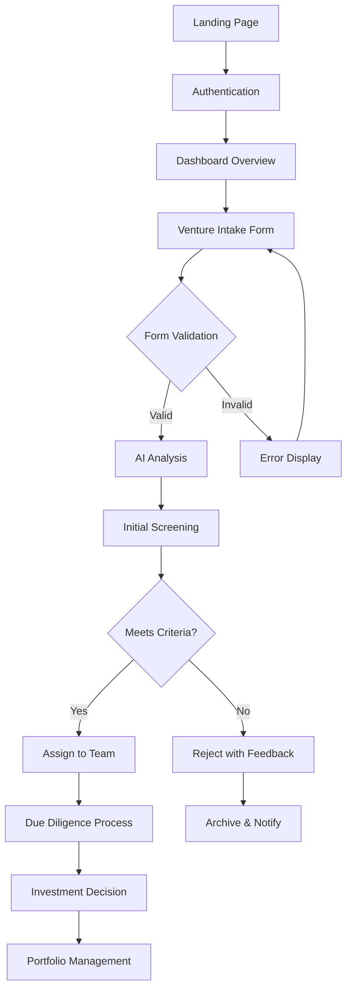
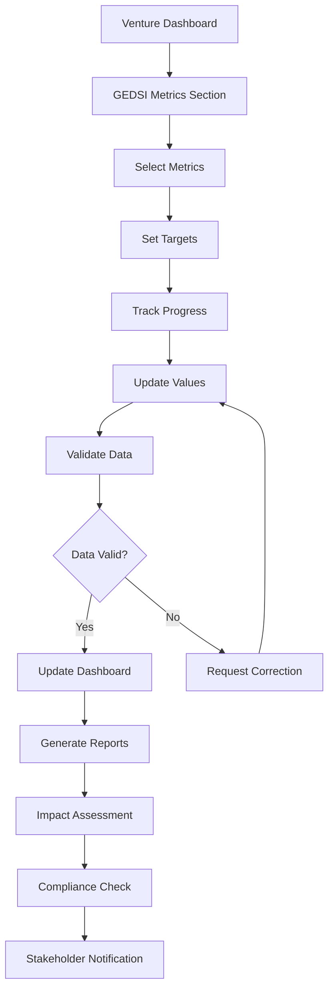
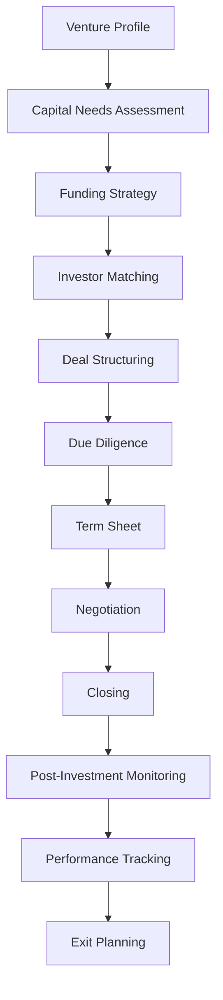

# MIV Platform - UX Flowchart & Structure

## 🎯 User Experience Overview

### **Target Users**
1. **Venture Managers** - Primary users managing venture pipeline
2. **GEDSI Analysts** - Specialists tracking inclusion metrics
3. **Capital Facilitators** - Team members managing funding processes
4. **Administrators** - System managers and team leads
5. **External Stakeholders** - Investors, partners, and venture founders

### **User Journey Stages**
1. **Onboarding** → **Discovery** → **Engagement** → **Analysis** → **Reporting** → **Optimization**

## 🏗️ Information Architecture

### **Primary Navigation Structure**

```
MIV Platform
├── 🏠 Dashboard (Overview)
├── 📋 Venture Management
│   ├── Intake & Screening
│   ├── Due Diligence
│   ├── Investment Ready
│   └── Portfolio Management
├── 📊 GEDSI Integration
│   ├── Metrics Tracking
│   ├── Impact Assessment
│   ├── Compliance Monitoring
│   └── Reporting
├── 💰 Capital Facilitation
│   ├── Funding Pipeline
│   ├── Investor Relations
│   ├── Deal Management
│   └── Financial Tracking
├── 📈 Analytics & Insights
│   ├── Performance Analytics
│   ├── Impact Reports
│   ├── Predictive Analytics
│   └── Custom Dashboards
├── 👥 Team Management
│   ├── User Management
│   ├── Role & Permissions
│   ├── Collaboration Tools
│   └── Communication Hub
└── ⚙️ System Administration
    ├── Settings & Configuration
    ├── Data Management
    ├── Integration Hub
    └── Help & Support
```

## 🔄 User Flow Diagrams

### **1. Venture Intake Flow**



### **2. GEDSI Tracking Flow**



### **3. Capital Facilitation Flow**



## 📱 Page Structure & Layout

### **1. Landing Page (Public)**

```
┌─────────────────────────────────────────────────────────┐
│                    Header Navigation                     │
├─────────────────────────────────────────────────────────┤
│                                                         │
│  ┌─────────────────┐  ┌─────────────────┐              │
│  │   Hero Section  │  │  Quick Stats    │              │
│  │                 │  │                 │              │
│  │  MIV Platform   │  │  • 150+         │              │
│  │  Empowering     │  │    Ventures     │              │
│  │  Inclusive      │  │  • $25M+        │              │
│  │  Ventures       │  │    Facilitated  │              │
│  │                 │  │  • 95% GEDSI    │              │
│  │  [Get Started]  │  │    Compliance   │              │
│  └─────────────────┘  └─────────────────┘              │
│                                                         │
├─────────────────────────────────────────────────────────┤
│  ┌─────────────────┐  ┌─────────────────┐              │
│  │  Key Features   │  │  Success Stories│              │
│  │                 │  │                 │              │
│  │  • Venture      │  │  • GreenTech    │              │
│  │    Pipeline     │  │    Solutions    │              │
│  │  • GEDSI        │  │  • EcoFarm      │              │
│  │    Tracking     │  │    Vietnam      │              │
│  │  • Capital      │  │  • TechStart    │              │
│  │    Facilitation │  │    Cambodia     │              │
│  └─────────────────┘  └─────────────────┘              │
│                                                         │
├─────────────────────────────────────────────────────────┤
│                    Footer                                │
└─────────────────────────────────────────────────────────┘
```

### **2. Dashboard (Authenticated)**

```
┌─────────────────────────────────────────────────────────┐
│  Sidebar │  Header Bar                                  │
│          │  [User Menu] [Notifications] [Settings]     │
├──────────┼─────────────────────────────────────────────┤
│          │                                             │
│  [🏠]    │  ┌─────────────────────────────────────────┐ │
│  Dashboard│  │  Welcome Back, [User Name]             │ │
│          │  │  Here's your MIV overview               │ │
│  [📋]    │  └─────────────────────────────────────────┘ │
│  Ventures│                                             │
│          │  ┌─────────────┐ ┌─────────────┐           │
│  [📊]    │  │ Pipeline    │ │ GEDSI       │           │
│  GEDSI   │  │ Overview    │ │ Progress    │           │
│          │  │             │ │             │           │
│  [💰]    │  │ • 25 Active │ │ • 85%       │           │
│  Capital │  │ • 8 Pending │ │   Complete  │           │
│          │  │ • 3 Ready   │ │ • 12        │           │
│  [📈]    │  └─────────────┘ │   Metrics   │           │
│  Analytics│                 └─────────────┘           │
│          │                                             │
│  [👥]    │  ┌─────────────┐ ┌─────────────┐           │
│  Team    │  │ Capital     │ │ Recent      │           │
│          │  │ Activities  │ │ Activities  │           │
│  [⚙️]    │  │             │ │             │           │
│  Settings│  │ • $2.5M     │ │ • Venture   │           │
│          │  │   Facilitated│ │   Created   │           │
│          │  │ • 3 Deals   │ │ • Metric    │           │
│          │  │   Closed    │ │   Updated   │           │
│          │  └─────────────┘ └─────────────┘           │
│          │                                             │
└──────────┴─────────────────────────────────────────────┘
```

### **3. Venture Management Page**

```
┌─────────────────────────────────────────────────────────┐
│  Sidebar │  Venture Management                          │
│          │  [Filter] [Search] [Add New] [Export]       │
├──────────┼─────────────────────────────────────────────┤
│          │                                             │
│          │  ┌─────────────────────────────────────────┐ │
│          │  │  Pipeline Stages                        │ │
│          │  │  [Intake] [Screening] [DD] [Ready]      │ │
│          │  └─────────────────────────────────────────┘ │
│          │                                             │
│          │  ┌─────────────────────────────────────────┐ │
│          │  │  Ventures Table                         │ │
│          │  │  ┌─────┬─────────┬─────────┬─────────┐  │ │
│          │  │  │Name │ Sector  │ Stage   │ Actions │  │ │
│          │  │  ├─────┼─────────┼─────────┼─────────┤  │ │
│          │  │  │Green│ Clean   │Screening│ [View]  │  │ │
│          │  │  │Tech │ Tech    │         │ [Edit]  │  │ │
│          │  │  ├─────┼─────────┼─────────┼─────────┤  │ │
│          │  │  │Eco  │ Agricul │ Due     │ [View]  │  │ │
│          │  │  │Farm │ ture    │ Dilig.  │ [Edit]  │  │ │
│          │  │  └─────┴─────────┴─────────┴─────────┘  │ │
│          │  └─────────────────────────────────────────┘ │
│          │                                             │
│          │  ┌─────────────────────────────────────────┐ │
│          │  │  Quick Actions                          │ │
│          │  │  [Bulk Update] [Generate Report]        │ │
│          │  └─────────────────────────────────────────┘ │
│          │                                             │
└──────────┴─────────────────────────────────────────────┘
```

### **4. GEDSI Tracker Page**

```
┌─────────────────────────────────────────────────────────┐
│  Sidebar │  GEDSI Integration                           │
│          │  [Filter by Category] [Add Metric] [Report] │
├──────────┼─────────────────────────────────────────────┤
│          │                                             │
│          │  ┌─────────────────────────────────────────┐ │
│          │  │  GEDSI Overview                         │ │
│          │  │  ┌─────────┬─────────┬─────────┬──────┐ │ │
│          │  │  │ Gender  │Disability│ Social  │Total │ │ │
│          │  │  │ 85%     │ 72%     │ 91%     │ 83%  │ │ │
│          │  │  └─────────┴─────────┴─────────┴──────┘ │ │
│          │  └─────────────────────────────────────────┘ │
│          │                                             │
│          │  ┌─────────────────────────────────────────┐ │
│          │  │  Metrics by Venture                     │ │
│          │  │  ┌─────┬─────────┬─────────┬─────────┐  │ │
│          │  │  │Vent.│ Metric  │ Target  │ Current │  │ │
│          │  │  │Name │ Code    │ Value   │ Value   │  │ │
│          │  │  ├─────┼─────────┼─────────┼─────────┤  │ │
│          │  │  │Green│ OI.1    │ 100     │ 25      │  │ │
│          │  │  │Tech │ Women-  │ ventures│ ventures│  │ │
│          │  │  │     │ led     │         │         │  │ │
│          │  │  ├─────┼─────────┼─────────┼─────────┤  │ │
│          │  │  │Eco  │ OI.2    │ 50      │ 15      │  │ │
│          │  │  │Farm │ Disabil.│ ventures│ ventures│  │ │
│          │  │  │     │ -incl.  │         │         │  │ │
│          │  │  └─────┴─────────┴─────────┴─────────┘  │ │
│          │  └─────────────────────────────────────────┘ │
│          │                                             │
│          │  ┌─────────────────────────────────────────┐ │
│          │  │  Progress Charts                        │ │
│          │  │  [Bar Chart] [Line Chart] [Pie Chart]   │ │
│          │  └─────────────────────────────────────────┘ │
│          │                                             │
└──────────┴─────────────────────────────────────────────┘
```

## 🎨 Design System & Components

### **Color Palette**

```css
/* Primary Colors */
--primary-50: #eff6ff;
--primary-100: #dbeafe;
--primary-500: #3b82f6;
--primary-600: #2563eb;
--primary-700: #1d4ed8;
--primary-900: #1e3a8a;

/* Secondary Colors */
--secondary-50: #f8fafc;
--secondary-100: #f1f5f9;
--secondary-500: #64748b;
--secondary-600: #475569;
--secondary-700: #334155;
--secondary-900: #0f172a;

/* Success Colors */
--success-50: #f0fdf4;
--success-500: #22c55e;
--success-600: #16a34a;

/* Warning Colors */
--warning-50: #fffbeb;
--warning-500: #f59e0b;
--warning-600: #d97706;

/* Error Colors */
--error-50: #fef2f2;
--error-500: #ef4444;
--error-600: #dc2626;

/* GEDSI Category Colors */
--gender-500: #ec4899;
--disability-500: #8b5cf6;
--social-500: #06b6d4;
--cross-cutting-500: #f97316;
```

### **Typography Scale**

```css
/* Font Sizes */
--text-xs: 0.75rem;    /* 12px */
--text-sm: 0.875rem;   /* 14px */
--text-base: 1rem;     /* 16px */
--text-lg: 1.125rem;   /* 18px */
--text-xl: 1.25rem;    /* 20px */
--text-2xl: 1.5rem;    /* 24px */
--text-3xl: 1.875rem;  /* 30px */
--text-4xl: 2.25rem;   /* 36px */

/* Font Weights */
--font-light: 300;
--font-normal: 400;
--font-medium: 500;
--font-semibold: 600;
--font-bold: 700;
--font-extrabold: 800;
```

### **Component Library**

#### **Navigation Components**
```typescript
// Sidebar Navigation
interface SidebarItem {
  name: string;
  icon: LucideIcon;
  href: string;
  section: 'MAIN' | 'REPORTS' | 'SETTINGS';
  badge?: number;
  children?: SidebarItem[];
}

// Breadcrumb Navigation
interface BreadcrumbItem {
  label: string;
  href?: string;
  current?: boolean;
}
```

#### **Data Display Components**
```typescript
// Data Table
interface DataTableProps<T> {
  data: T[];
  columns: ColumnDef<T>[];
  pagination?: boolean;
  search?: boolean;
  filters?: FilterConfig[];
  actions?: ActionConfig<T>[];
}

// Charts & Graphs
interface ChartProps {
  type: 'bar' | 'line' | 'pie' | 'doughnut' | 'area';
  data: ChartData;
  options?: ChartOptions;
  responsive?: boolean;
}
```

#### **Form Components**
```typescript
// Multi-step Form
interface FormStep {
  id: string;
  title: string;
  description: string;
  fields: FormField[];
  validation?: ValidationSchema;
}

// Dynamic Form Builder
interface FormBuilder {
  sections: FormSection[];
  conditionalLogic?: ConditionalRule[];
  autoSave?: boolean;
}
```

## 🔄 User Interaction Patterns

### **1. Progressive Disclosure**

```
Level 1: Overview Dashboard
├── High-level metrics
├── Recent activities
└── Quick actions

Level 2: Detailed Views
├── Filtered data tables
├── Advanced charts
└── Bulk operations

Level 3: Deep Dive
├── Individual records
├── Historical data
└── Advanced analytics
```

### **2. Contextual Actions**

```typescript
// Context Menu Actions
interface ContextAction {
  label: string;
  icon: LucideIcon;
  action: (item: any) => void;
  condition?: (item: any) => boolean;
  shortcut?: string;
}

// Bulk Actions
interface BulkAction {
  label: string;
  icon: LucideIcon;
  action: (items: any[]) => void;
  confirmation?: string;
}
```

### **3. Real-time Updates**

```typescript
// WebSocket Events
interface RealTimeEvent {
  type: 'VENTURE_UPDATED' | 'METRIC_CHANGED' | 'NOTIFICATION';
  data: any;
  timestamp: Date;
  userId?: string;
}

// Live Indicators
interface LiveIndicator {
  type: 'online' | 'offline' | 'typing' | 'viewing';
  userId: string;
  timestamp: Date;
}
```

## 📱 Responsive Design Strategy

### **Breakpoint System**

```css
/* Mobile First Approach */
--breakpoint-sm: 640px;   /* Small devices */
--breakpoint-md: 768px;   /* Medium devices */
--breakpoint-lg: 1024px;  /* Large devices */
--breakpoint-xl: 1280px;  /* Extra large devices */
--breakpoint-2xl: 1536px; /* 2X large devices */
```

### **Layout Adaptations**

#### **Mobile (< 768px)**
- Collapsible sidebar
- Stacked card layouts
- Touch-friendly buttons
- Simplified navigation
- Bottom navigation bar

#### **Tablet (768px - 1024px)**
- Sidebar with icons only
- Two-column layouts
- Medium-sized components
- Swipe gestures

#### **Desktop (> 1024px)**
- Full sidebar navigation
- Multi-column layouts
- Hover states
- Keyboard shortcuts
- Advanced interactions

## 🎯 Accessibility Guidelines

### **WCAG 2.1 AA Compliance**

```typescript
// Accessibility Features
interface AccessibilityConfig {
  // Keyboard Navigation
  keyboardNavigation: boolean;
  focusIndicators: boolean;
  skipLinks: boolean;
  
  // Screen Reader Support
  ariaLabels: boolean;
  semanticHTML: boolean;
  altText: boolean;
  
  // Color & Contrast
  highContrast: boolean;
  colorBlindFriendly: boolean;
  fontSizeAdjustable: boolean;
  
  // Motion & Animation
  reducedMotion: boolean;
  animationControls: boolean;
}
```

### **Internationalization (i18n)**

```typescript
// Multi-language Support
interface LocalizationConfig {
  defaultLocale: 'en';
  supportedLocales: ['en', 'vi', 'km', 'th', 'lo'];
  dateFormats: {
    en: 'MM/DD/YYYY';
    vi: 'DD/MM/YYYY';
    km: 'DD/MM/YYYY';
  };
  numberFormats: {
    en: { currency: 'USD' };
    vi: { currency: 'VND' };
    km: { currency: 'KHR' };
  };
}
```

## 🚀 Performance Optimization

### **Loading Strategies**

```typescript
// Progressive Loading
interface LoadingStrategy {
  // Initial Load
  criticalPath: string[];
  lazyLoad: string[];
  
  // Data Loading
  pagination: number;
  infiniteScroll: boolean;
  virtualScrolling: boolean;
  
  // Caching
  cacheStrategy: 'memory' | 'localStorage' | 'serviceWorker';
  cacheTTL: number;
}
```

### **Performance Metrics**

```typescript
// Core Web Vitals
interface PerformanceMetrics {
  // Loading Performance
  firstContentfulPaint: number;
  largestContentfulPaint: number;
  
  // Interactivity
  firstInputDelay: number;
  cumulativeLayoutShift: number;
  
  // Custom Metrics
  timeToInteractive: number;
  totalBlockingTime: number;
}
```

## 📊 Analytics & User Research

### **User Behavior Tracking**

```typescript
// Analytics Events
interface AnalyticsEvent {
  event: string;
  category: 'navigation' | 'interaction' | 'conversion';
  action: string;
  label?: string;
  value?: number;
  userId?: string;
  timestamp: Date;
  sessionId: string;
}

// User Journey Mapping
interface UserJourney {
  userId: string;
  sessionId: string;
  touchpoints: Touchpoint[];
  conversion: boolean;
  duration: number;
  bounceRate: boolean;
}
```

### **A/B Testing Framework**

```typescript
// Experiment Configuration
interface Experiment {
  id: string;
  name: string;
  hypothesis: string;
  variants: Variant[];
  trafficSplit: number[];
  metrics: string[];
  duration: number;
  status: 'draft' | 'running' | 'completed';
}
```

This comprehensive UX structure provides a solid foundation for building an intuitive, scalable, and user-friendly MIV platform that aligns with enterprise standards and user expectations. 